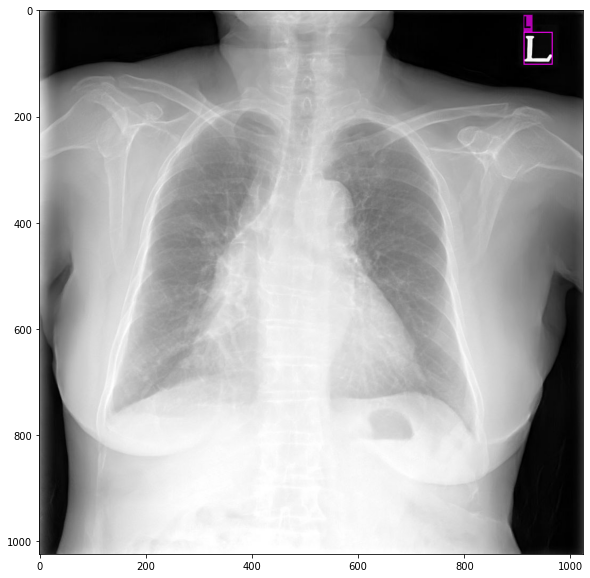
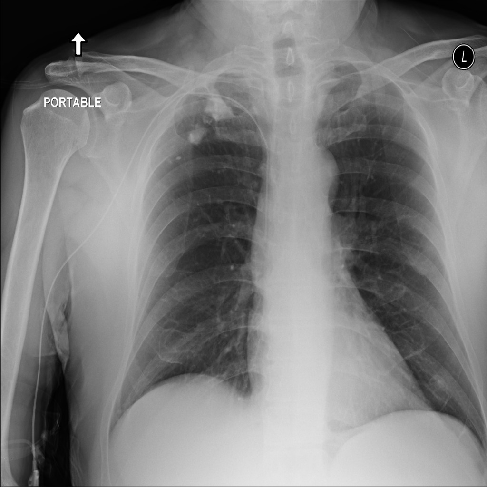

<a href="https://colab.research.google.com/github/jhgan00/cxr-detector/blob/master/cxr_detector.ipynb" target="_parent"></a>

# CXR Detector

> CXR 사진에서 L 문자 디텍션
>
> - 모델:  [YOLO v3](https://github.com/AlexeyAB/darknet)
>
> - Test dataset 성능: 0.9942 (mAP@0.5)
>
> - [RSNA pneumonia detection challenge dataset](https://www.kaggle.com/c/rsna-pneumonia-detection-challenge) 성능: 0.1232 (mAP@0.5)

# 0. Build darknet

```
import os
os.chdir("./drive/My Drive/")
!git clone https://github.com/AlexeyAB/darknet.git
os.chdir("darknet")
!sed '1 s/^.*$/GPU=1/; 2 s/^.*$/CUDNN=1/' -i Makefile
!make
```

# 1. Train


## 1.1 Config

- \# of train images: 1,800
- \# of valid images: 200
- \# of test images: 200

params|values
---|---
batch|64
subdivisions|16
width|416
height|416
channels|3
momentum|0.9
decay|0.0005
angle|0
saturation|1.5
exposure|1.5
hue|0.1
learning_rate|0.001
burn_in|1000
max_batches|6000
policy|steps
steps|4800,5400
scales|0.1,0.1

## 1.2. Training


```python
import os
os.chdir("drive/My Drive/darknet")
!chmod +x darknet
```


```python
!cat cfg/cxr.data
```

- Start training with Darknet53.Conv.74 weights pretrained for classification on ImageNet dataset 


```python
!./darknet detector train \
    cfg/cxr.data \
    cfg/cxr_yolov3_train.cfg \
    darknet53.conv.74 \
    -map
```

- Restore the latest checkpoint & continue training


```python
!./darknet detector train \
    cfg/cxr.data \
    cfg/cxr_yolov3_train.cfg \
    backup/cxr_yolov3_train_last.weights \
    -map
```

## 1.3. Check validation samples

#### 1.3.1. Output images


```python
!./darknet detector test \
    cfg/cxr.data \
    cfg/cxr_yolov3_train.cfg \
    backup/cxr_yolov3_train_best.weights \
    images/000-pgan-cxr_abnormal-preset-v2-1gpu-fp32-network-snapshot-014000-001285.png
```


```python
import matplotlib.pyplot as plt
plt.figure(figsize = (10,10))
plt.imshow(plt.imread("predictions.jpg"))
```



### 1.3.2. **1.00 mAP** at IoU=50

```
!./darknet detector map \
	cfg/cxr.data \
    cfg/cxr_yolov3_train.cfg \
    backup/cxr_yolov3_train_best.weights
```


```bash
detections_count = 282, unique_truth_count = 200  
class_id = 0, name = L, ap = 100.00%   	 (TP = 200, FP = 0) 

for conf_thresh = 0.25, precision = 1.00, recall = 1.00, F1-score = 1.00 
for conf_thresh = 0.25, TP = 200, FP = 0, FN = 0, average IoU = 77.03 % 

IoU threshold = 50 %, used Area-Under-Curve for each unique Recall 
mean average precision (mAP@0.50) = 1.000000, or 100.00 % 
Total Detection Time: 145 Seconds
```

# 2. Test

## 2.1. PGAN Test dataset

### 2.1.1. **0.9942 mAP** at IoU=50


```python
!./darknet detector map \
    cfg/cxr-test.data \
    cfg/cxr_yolov3_train.cfg \
    backup/cxr_yolov3_train_best.weights \
    -points 0
```

```
detections_count = 274, unique_truth_count = 197  
class_id = 0, name = L, ap = 99.42%   	 (TP = 194, FP = 0) 

for conf_thresh = 0.25, precision = 1.00, recall = 0.98, F1-score = 0.99 
for conf_thresh = 0.25, TP = 194, FP = 0, FN = 3, average IoU = 79.09 % 

IoU threshold = 50 %, used Area-Under-Curve for each unique Recall 
mean average precision (mAP@0.50) = 0.994191, or 99.42 % 
```

## 2.2. RSNA Pneumonia detection dataset



### 2.2.1. 0.1232 mAP at IoU=50


```bash
!./darknet detector map \
    cfg/cxr-kaggle-test.data \
    cfg/cxr_yolov3_train.cfg \
    backup/cxr_yolov3_train_best.weights
```

```
detections_count = 1049, unique_truth_count = 181  
class_id = 0, name = L, ap = 12.32%   	 (TP = 43, FP = 143) 

for conf_thresh = 0.25, precision = 0.23, recall = 0.24, F1-score = 0.23 
for conf_thresh = 0.25, TP = 43, FP = 143, FN = 138, average IoU = 14.08 % 

IoU threshold = 50 %, used Area-Under-Curve for each unique Recall 
mean average precision (mAP@0.50) = 0.123228, or 12.32 % 
 
```

# 참고자료

- [darknet](https://github.com/AlexeyAB/darknet)
- [RSNA pneumonia detection challenge dataset](https://www.kaggle.com/c/rsna-pneumonia-detection-challenge)
- [Yolo_Label](https://github.com/developer0hye/Yolo_Label)
